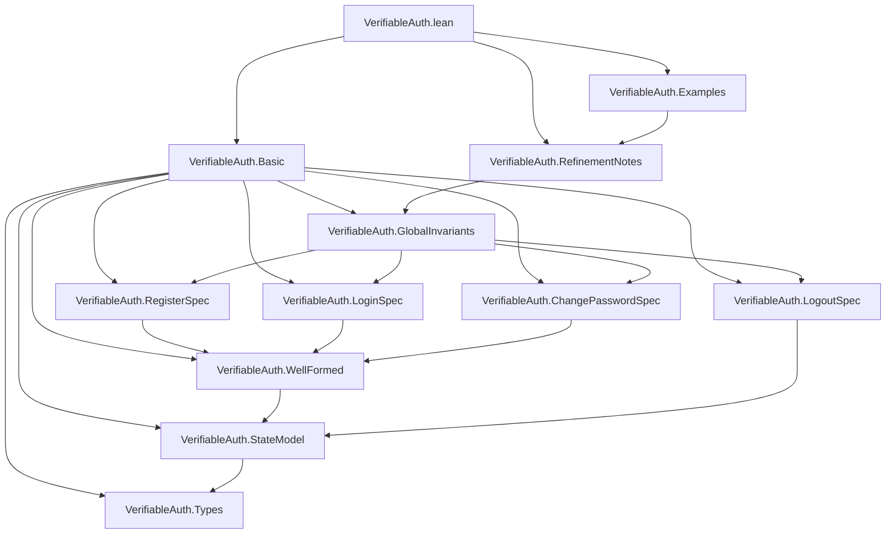

# Verifiable Auth Lean Spec

This directory contains the Lean reference model for the authentication state
machine implemented in `../engine/src/core` and refined by the CLI, audit, and
metrics behavior in `../engine/src/cli`, `../engine/src/app`, and
`../engine/src/storage`.

## Package Layout

- `lakefile.toml` defines the Lake package and the `VerifiableAuth` library.
- `lean-toolchain` pins the Lean toolchain used by the spec.
- `VerifiableAuth.lean` is the package root import for downstream consumers.
- `VerifiableAuth/` contains the module graph for the state model and proofs.

## Import Graph

Each arrow below means "imports". The root module for downstream consumers is
`VerifiableAuth.lean`.



## Build

```powershell
$env:ELAN_HOME = Join-Path $HOME '.elan'
$env:PATH = "$env:ELAN_HOME\bin;$env:PATH"
lake build
```

## Scope

- Symbolic state model for registration, login, password change, and logout
- Structural well-formedness and key safety invariants
- CLI/audit/metrics refinement helpers aligned with the current C app layer

For the current cross-layer status, see
[`../docs/spec-engine-alignment.md`](../docs/spec-engine-alignment.md).
For the primary formal-to-implementation evidence artifact, see
[`../docs/spec-engine-comparison-table.md`](../docs/spec-engine-comparison-table.md).
For a broader document map, see [`../docs/README.md`](../docs/README.md).

The model keeps hashing and salt generation symbolic. It mirrors the current
engine's branch structure and observable behavior without reproducing the C
implementation's cryptographic internals.
